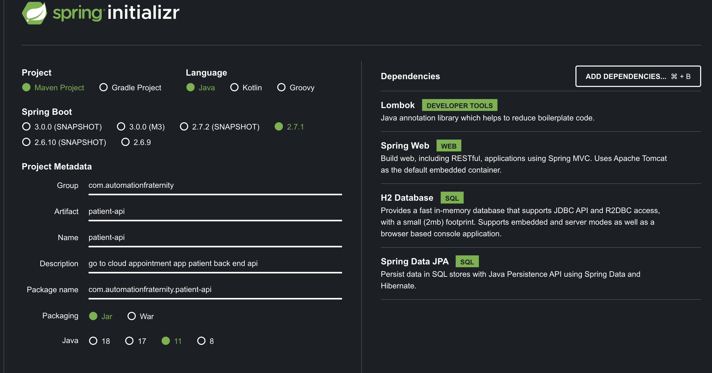
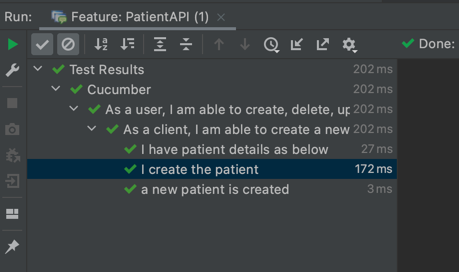
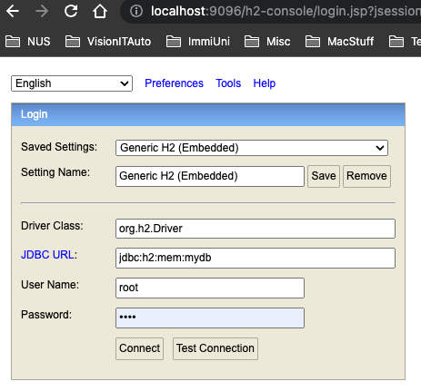
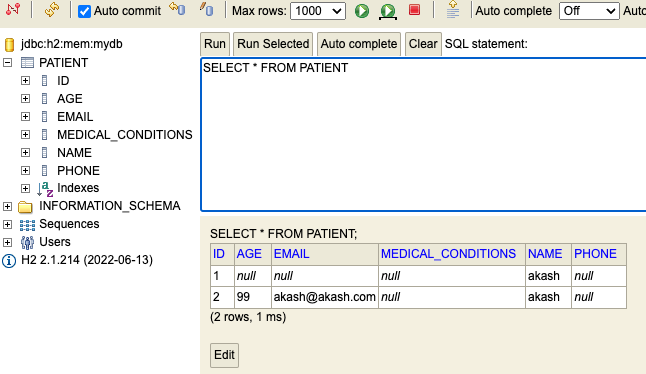
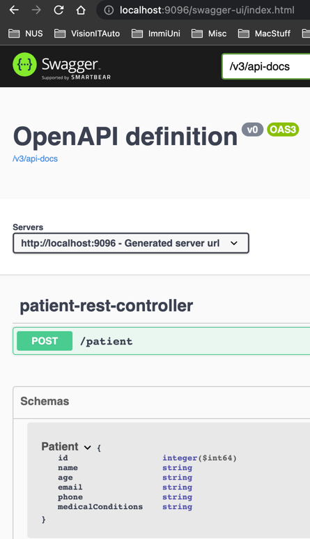
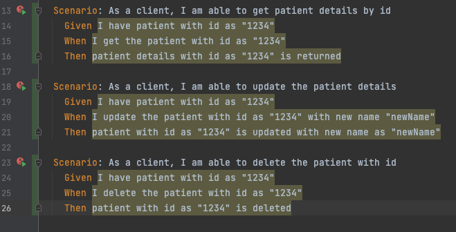
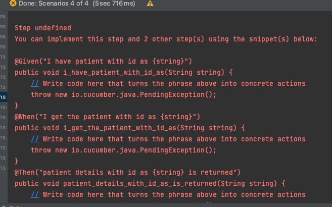
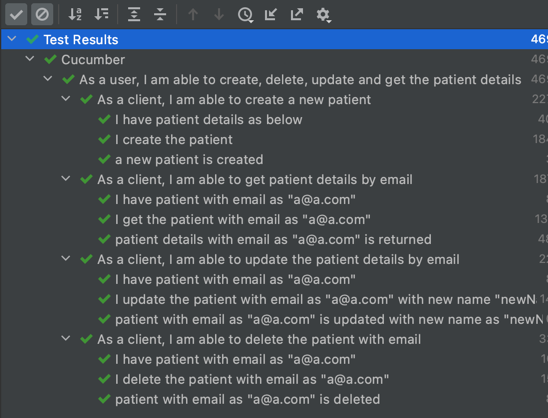

# patient-springboot-reference-api
This repository contains the Spring Boot reference API with a Step by Step Guide on how to develop a Spring boot API using ```Behaviour Driven Development.```

---

### Summary: 
* This API is being developed using Behaviour Driven Development methodology.
* This methodolgy is a Bottom Down Approach i.e. Business Requirement Drives the Development of the Service.
* In the Process we keep taking requirement from the Business (BA or Actual Client); we capture the requirement in the English Like Syntax called as <b>Gherkin</b>.
* The developer then keep running these requirements and keep implementing them and in the process keep testing the app as well.
* At the end, what you get is a full API which completely conforms to the Business Requirement, nothing less, nothing more.
* Just to Highlight, there is another thing called ```Test Driven Development```. Wanted to assert that we are not doing TDD, TDD does not keep Business Requirment at its center, rather focused more on what can be called as "making the software, right way" and focused more on Unit Tests.
* BDD or ATDD is primarily focused on the actual non technical requirements and making sure the developer is implementing exactly that.
* Follow this guide and You will get to see, how this is done.

---

#### How to use this guide: 
This is a Step by Step Guide. 
I have maintained different Steps; which is nothing but a Topic which is maintained under different branches. Each Topic are numbered.

```So, in short, Each Branch = A Step = A Topic```

The latest version however is always merged in the master, so master contains the code of all the steps/Topics.

Below are the series of Topics which is covered in this tutorial:
* Step 0: Pre-requisite:  Create a Spring Boot ref API.
* Step 1. Cucumber Feature File Creation
* Step 2. Cucumber Step Def and Cucumber Spring Set Up
* Step 3: Write Integration Tests First. BDD/ATDD. Branch: ```3_added_mock_mvc_config_and_steps```
* Step 4: Add Spring Boot Controller Class and Create Post End Point. Branch:  ```4_impl_controller_post_end_point```
* Step 5: Add Model and Service for Patient Entity. Branch:    ```5_impl_model_service_repo`````
* Step 6: Add H2 Database. Branch:   ```6_h2_db_impl```
* Step 7: Create API Documentation using Open Spec and Swagger. Branch:  ```7-swagger-impl```
* Step 8: Add new Cucumber Feature file for PUT/POST/DELETE API end point and test vcases. Branch:  ```8-new-features-get-put-delete```
* Step 9: Dockerize the APP using Google JIB and Push image to Docker HUB. Branch:  ```Step-9-dockerize-app-using-jib```
* Step 10: Configure Sonar Qube for Code Smell and Static Code analysis. Add Unit Tests for 80 percent code Coverage. Jacoco plugin to generate code coverage reports. Branch:  ```step-10-sonar-and-jacoco-code-coverage```
* Step 11: ```Not Started``` TODO: Impl Central Error Management in API.
* Step 12: ```Not Started``` TODO: Secure your API
* Step 13: ```Not Started``` TODO: Configure CI using Git Hub Actions
* Step 14: ```Not Started``` TODO: Configure CD using Git Hub Actions and Deploy on AWS Elastic Kubernetes Services.
* Step 15: ```Not Started``` TODO: Write Post Deployment Integration Tests.
* Step 16: ```Not Started``` TODO: Run Post deployment Performance Tests.
  


### Steps to Follow: Keep Checkout the branch to see the changes done. Steps are managed under the branches to easily witness the changes made in each step.

---

#### Step 0: Spring.io Init 
* Use Spring Initializer URL: https://start.spring.io/.
* Add dependencies as mentioned in the below Screen shot.
* Download the project and open it in IntelliJ


#### Step 1: Cucumber Feature File Creation

* Checkout Branch: ```1_feature_file_cucumber_setup```:
    * Add cucumber related libraries in the pom.xml file. 
        * below cucumber libraries are necessary
            * ```xml
                  <dependency>
                    <groupId>io.cucumber</groupId>
                    <artifactId>cucumber-java</artifactId>
                    <version>${cucumber.version}</version>
                    <scope>test</scope>
                  </dependency>
          
                <dependency>
                  <groupId>io.cucumber</groupId>
                  <artifactId>cucumber-junit</artifactId>
                  <version>${cucumber.version}</version>
                </dependency>
          
                <dependency>
                  <groupId>io.cucumber</groupId>
                  <artifactId>cucumber-spring</artifactId>
                  <version>${cucumber.version}</version>
                  <scope>test</scope>
                </dependency>
          
                <dependency>
                  <groupId>io.cucumber</groupId>
                  <artifactId>cucumber-junit-platform-engine</artifactId>
                  <version>${cucumber.version}</version>
                </dependency>
              ```
    * Now run your Feature file (You need cucumber plugin in your intelliJ/IDE), it will fail and will ask you to add a CucumberSpringConfiguration file. 
    * Add this file: 
      ```java
          import io.cucumber.spring.CucumberContextConfiguration;
          import org.springframework.boot.test.context.SpringBootTest;

          @SpringBootTest
          @CucumberContextConfiguration
          public class CucumberSpringConfiguration {
          }
      ```
    * After adding this file, please run the feature file again.
    * If will fail again, but will fail do to missing implimentation of the cucumber Steps:
        ```java
            
            //Step undefined
            //You can implement this step and 2 other step(s) using the snippet(s) below:
            
            @Given("I have application up and running")
            public void i_have_application_up_and_running() {
            // Write code here that turns the phrase above into concrete actions
            throw new io.cucumber.java.PendingException();
            }
      
            ...
        ```
---

#### Step 2. Cucumber Step Def and Cucumber Spring Set Up

* Checkout Branch: ```2_add_cucumber_stepdef```
    * Run the Feature file again and this time you will see the step defs in the console as mentioned in above code snippet.
    * Copy the methods names and create a new class under integrationtests package and save the methods there.
    * Run the feature file again and this time there will be failure but different kind of error.
    * New Error will now say, pending steps, this is how cucumber is asking you to implement the test.
      * ```text
            
        Step pending
        TODO: implement me
        
        ```
        
    * You can now write tests which resembles the functinality or Behaviour which we created earlier in Gherkin or in our PatientApi.feature file. 
      In the next step/branch we will implement our test.
    * Those test will fail again, but still we will implement it. Because we are going BDD but also adopting how TDD is practiced. i.e. you write the test and then run it and then fix the errors and then run it again. Simple! The same sort of approach is what we are trying to do. 
    * But to highlight, we are not entirely doing a TDD or test driven development at the moment. We are still doing BDD, but TDD style!!
    * So far, our tests are failing but they are not failing due to api's expected functional behaviour or so to say, what this api should do. Lets implement the test in the next steps.

---

#### Step 3: Write Integration Tests First. BDD/ATDD

* Checkout Branch: ```3_added_mock_mvc_config_and_steps```
    * Well now in this step we will use Spring's Mock Mvc class to write our test.
    * MockMvc is a class which has all the necessary methods to make an http call and we can set the verb i.e. get/post/put/delete and other relevant information like contentType, Body, headers etc.
    * To make it work, we need two more additional settings, 1. we need to tell Spring to Auto Configure this Bean or Object which is MockMvc and all its dependencies. This we will do in "CucumberSpringConfiguration.class".
    * Secondly, we need to inject this MockMvc object in our StepDefs.class file so that we can use its methods to perform http calls on our "yet to be creatd", api post end point. This we do by using another annotation called  @AutoWired. This annotation is responsible for injecting the bean or object in our Step Def class file. This is also called as Dependency Injection and this concept is at the heart of Spring frameworks."
    * Once, we do this we can then use this object to write our test which is structured with in the cucumber methods.
    * See the StepDef.class under test folder.
    * From feature file, we are sending some data, which is what we are capturing in the Given step using map collection type.
    * We are then converting the data in to a string for our request and in the when step we are performing the post operation.
    * In the last step we are using a assertion statement to validate that the response of the call has status code as '201'. This is the most important step of the test and this detemines what to expect from a user Scenario expressed in Gherkin feature file.
    * And we will do again, what we always do, i.e. we will Run the Feature file. And this time when you will run it, two steps will pass and one fail with the reason that API did not respond with status as "201". Which is obvious because, API is not yet created and localhost server send 404 status code in reply.
        * Error:
           ```text
            Step failed
            java.lang.AssertionError: Response status expected:<201> but was:<404>
          
            ```
---

#### Step 4: Add Spring Boot Controller Class and Create Post End Point

* Checkout Branch: ```4_impl_controller_post_end_point```
    * Now enough of tests. Now I need to make this test pass.
    * So, I will start Controller Class. This class is the face of our rest full API.
    * This controller class will receive the request from the client software and it will reroute it to the relevant business logic and pass the sent data to that Business Login Method.
    * Then I will add the controller class.
    * ```java
        @RestController
        @RequestMapping("/")
        public class PatientRestController {
        
            @PostMapping("/patient")
            public String createPatient(){
                return "";
            }
        }
        ```
    * I have added three main annotations here, @RestController, @RequestMapping and @PostMapping. This is returing an empty string.
    * One more important change I have made here in this step. I have added a ```application.yml``` file. This file contains all the necessary Spring configuration settings. Currently, it has just one setting i.e. port number. I have set up as 9096, you can choose valid port.
    * I have also modified, the server name in the test to point to http://localhost:9096
    * And now when I ran my test, the result was better than before; i.e. I am able to get a valid reply from the api i.e. status 200. 
    * But I know this is not correct and I need to implement more things, i.e Model class, DB connections, Service Class etc. All that we will do in next step.

---

#### Step 5: Add Model and Service for Patient Entity

* Checkout Branch: ```5_impl_model_service_repo```
  * Now we are really focused on developing our API. 
  * You need four basic things, to create crud api. Controller, Service, Repository and lastly an DB instance.
  * I will create the Model class first, to represent and manipulate my entity or simply the data.
  * Then I will create a service class, this service class will have logic to manipulate the data and call the repository(DB methods) method.
  * Finally, I will use a JPA Interface for DB operations. This I will call as repository. For this all I need to do is to create an interface and extend it with another interface called as JpaRepository. Spring boot is built on top of Spring and it has all the usefull features of the Spring including the DB persitance impl. This interface contains all the usefull DB operations, so that you do not have to write any queries. These queries are automatically generated for you on the fly. However, it also provides you ways to write your own custom queries. But all te basic db operations, like select, insert etc are actually covered.
    * JpaRepository is a JPA (Java Persistence API) specific extension of Repository.
    * It contains the full API of CrudRepository and PagingAndSortingRepository.
    * T: Domain type that repository manages (Generally the Entity/Model class name)
    * ID: Type of the id of the entity that repository manages (Generally the wrapper class of your @Id that is created inside the Entity/Model class)
  * Important things to note in these files.
  * Model: Annotated with ```@Entity``` and added a new variable/column id, annotated as ```@Id```.v Also, added lot of Lombok annotations like ```@Data, @Getter, @Setter etc``` to avoid boiler plate code.
  * Service: Contains the business Logic is aannotated as ```@Service```
  * Repositoy: This class extends ```JpaRepository.class```. This interface gives all the usefull methods which expresses or get converted in to queries during the actual DB interaction.
  * ```@Autowired```: This annotation is used to inject objects in the Spring Context. As stated earlier in previous step, Autowiring or Injection or Depdency Injection or IoC (Inversion of Control) are all related and almost things and is at the root of Spring Framework. In a laymen terms, Spring is asking us to tell Spring, what object you need and not to create it yourself. And Spring FW will manage the objects lifecycle and not you. So Simple statement, "In Spring, you do not create Object, you Inject them". By Injection, we mean a instrcution from "developer" to "Spring FW", that "Create" this object for me. It has huge advatages which we is not super evident when your software is this small. But has huge implications, when features in your software grows. Hwoever, to keep things simple, we will not go there at the moement.
  * Controller Class has a new annotation: ```@ResponseStatus``` this is to return the response code. There are better ways to do this, as we shall see in later steps. But for now, this is how we are going to return the status code.
  * You can run the API manually and run the curl command to see the effect.
    * ```curl --request POST --url http://localhost:9096/patient --header 'content-type: application/json' --data '{"name":"akash"}'```
  * Finally, we are going to modify our test to invoke this new end point and this time we have added one more assertion. i.e. checking the content of the response. This gives more validity to our test. So, as a thumb rule, add as many checkpoints, or assertions. These assertions, are the ones, which are the most important, component of your test. They are the ones, who catch your bugs.
  * And then we run it again and voila! its all green! 
  * 
  * But wait, where is our DB? Lets set up a simple DB in our next step.
  
---  

#### Step 6: Add H2 Database

* Checkout Branch: ```6_h2_db_impl```
  * Our test was getting passed earlier as well. Why? Because we already had a h2 db dependency in your POM.xml. If not added you will have to add this to enabled embedded h2 db. Note, this is only for development purposes and in production this has to be replaced with actual DB.
  ```xml
  
      <dependency>
          <groupId>com.h2database</groupId>
          <artifactId>h2</artifactId>
          <scope>runtime</scope>
      </dependency>
  
  ```
  * Once you add this dependency, you can add few config settings in your application.yml file.
      * It will have settings for h2 DB. The DB console can be accessed at url: http:localhost:9096/h2-console
      * 
      * 
      * We also have to cofigure, datasource so that spring jpa will know which DB connection string to link.
          ```yml
          spring:
            h2:
              console.enabled: true
              console.path: /h2-console
              console.settings.trace: false
              spring.h2.console.settings.web-allow-others: false
            datasource:
              url: jdbc:h2:mem:mydb # jdbc:h2:file:/data/demo if persistence is required for file
              username: root
              password: demo
              driverClassName: org.h2.Driver
            jpa:
              spring.jpa.database-platform: org.hibernate.dialect.H2Dialect
          ```
---

#### Step 7: Create API Documentation using Open Spec and Swagger

* Checkout Branch: ```7-swagger-impl```
  * API Documentation is important so that the user or client know what this API is capable is doing.
  * For this we can use Open API Specification aka swagger documentation.
  * Dependency to be added. Add the latest version, else some time it does not work.
  * Also add below lines in the application.yml file to configure the path. Navigate to the url: ```http://localhost:9096/swagger-ui/index.html```
  * 
 ```xml
  
  <dependency>
      <groupId>org.springdoc</groupId>
      <artifactId>springdoc-openapi-ui</artifactId>
      <version>1.6.9</version>
  </dependency>
  
  ```
 
  ```yml
  springdoc:
    swagger-ui:
    path: swagger-ui.html
  ```
---

#### Step 8: Add new Cucumber Feature file for PUT/POST/DELETE API end point and test cases

* Checkout Branch: ```8-new-features-get-put-delete```
* Well now we are back to Behaviour Driven Development. Now we want our API to have the capability to get, update and delete the patient details.
* So we follow the same series of Steps which we did in step 2 i.e.
    * Write the Features
    * Run the Feature
    * Copy the auto generated methods in the Step defs class file.
    * Implement the metods and test code and assertions in these methods.
    * Run them again and it fail again.
    * Write the dev code, to make your test pass later. (Use Step 4 and Step 5, '4_impl_controller_post_end_point' to know how to add end points and servicess)
    * All tests passesd, feature implemented successfully.
    * Write the unit tests. (this is not part of the BDD/ATDD, but its an important step, which we will see later.)
    * Note: when we implement the delete end point we have have added spring annotation ```@Transacational``` in the controller class. This annotation is important we write "derived delete methods" like deleteByEmail()
    
```java
    @Transactional
    public void deletePatient(@RequestParam String email){
        patientService.deletePatient(email);
    }
    
    //Patient Repo sitory class is the place to keep  derived methods
    public interface PatientRepository extends JpaRepository<Patient,Long> {
        List<Patient> findByEmail(String email);
        void deleteByEmail(String email); // this is a derived delete method and any method which invokes this has to use @Transactinal annotation.
    }
    
```




* After we implement all the steps and API end points as well, all tests will pass:



---

#### Step 9: Dockerize the APP using Google JIB and Push image to Docker HUB.

* Check out Branch: ```Step-9-dockerize-app-using-jib```
    * Now since our app is ready we shall pacakage it. Best way to package is by containerizing it so that we can run it on kubernetes which also is our ultimate goal.
    * There are two ways to dockerize a java app. Using conventional way i.e. using Dockerfile or using Google JIB. I will be using google JIB here. Google JIB has a added benefit i.e. it is a maven plugin so I can manage the docker config from with my pom.xml and secondly when we use google jib I do not need to have docker deamon (docker desktop etc) installed in the host machine.
    * All I need to do is to add below config in the pom.xml and that's it.
    * You can configure your container in many ways, however, this is how it looks with minimal settings.
        * in the 'to' segment, mention your docker hub repo or any other repo where you want to push the image
        * for tagging I am using the current project version
        * mention the port
    * this plugin gets triggered at package phase, as mentioned in below jenkins code snippet.
    * it needs to be provided with credential of your docker hub account using command line argument, some thing like mvn clean pacakage -Djib.to.auth.username=$u -Djib.to.auth.password=$p
    * I have covered this in this video series but there is another article and video on how to set up jenkins pipeline which I recorded earlier. You can see that as well here: https://github.com/akashdktyagi/springboot-ref-app-with-cucumber-test
    
```shell

  stage('Build Create and Push Image') {
      steps {
          withCredentials([usernamePassword(credentialsId: 'docker-hub', passwordVariable: 'p', usernameVariable: 'u')]) {
             sh "mvn -B clean install -Djib.to.auth.username=$u -Djib.to.auth.password=$p"
          }

      }     
    }
    
```

```xml
    <plugin>
        <groupId>com.google.cloud.tools</groupId>
        <artifactId>jib-maven-plugin</artifactId>
        <version>3.2.1</version>
        <configuration>
            <from>
                <image>openjdk:11</image>
            </from>
            <to>
                <image>docker.io/yantraqa/patient-api:${project.version}</image>
            </to>
            <container>
                <jvmFlags>
                    <jvmFlag>-Xms256m</jvmFlag>
                    <jvmFlag>-Xmx512m</jvmFlag>
                </jvmFlags>
                <ports>
                    <port>9096</port>
                  </ports>
              </container>
              <allowInsecureRegistries>true</allowInsecureRegistries>
          </configuration>
          <executions>
              <execution>
                  <phase>install</phase>
                  <goals>
                      <goal>build</goal>
                  </goals>
              </execution>
          </executions>
    </plugin>

```

---

#### Step 10: Configure Sonar Qube for Code Smell and Static Code analysis. Add Unit Tests for 80 percent code Coverage. Jacoco plugin to generate code coverage reports.

